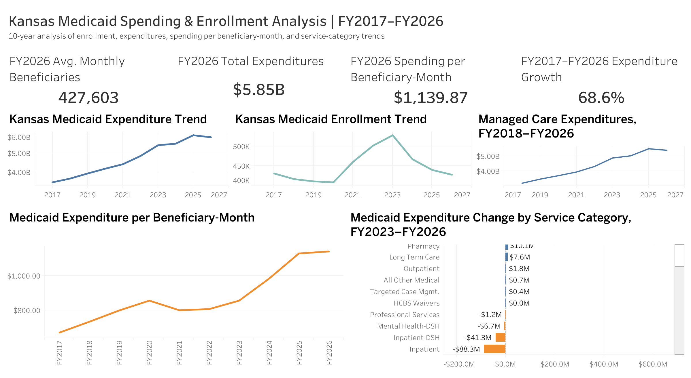

# Kansas Medicaid Spending & Enrollment Analysis
### FY2017–FY2026 | Python • Data Validation • Tableau

## Why I Built This Project

Kansas publishes detailed Medicaid spending and enrollment information through its annual Medical Assistance Reports. The information is publicly available, but much of it is stored in PDF reports rather than in a dataset that is ready for analysis.

I wanted to turn those reports into something that could answer a fairly simple question:

> **How have Kansas Medicaid spending and enrollment changed over the last 10 fiscal years, and how has spending relative to enrollment changed?**

Answering that question required more than making a few charts. I first had to extract and structure 10 years of monthly data, validate the results against the original reports, work through changes in reporting formats, and decide how to compare spending with a changing Medicaid population.

The final project covers **FY2017 through FY2026** and combines Python-based data extraction and analysis with an interactive Tableau dashboard.

---

## Dashboard

[**View the interactive dashboard on Tableau Public →**](https://public.tableau.com/app/profile/bijaya.basnet/viz/Kansas_Medicaid_Spending_Enrollment_Analysis_twbx/KansasMedicaidSpendingEnrollmentAnalysisFY2017FY2026)



### At a Glance

| FY2026 Metric | Value |
|---|---:|
| Average Monthly Beneficiaries | **427,603** |
| Total Medicaid Expenditures | **$5.85B** |
| Expenditure per Beneficiary-Month | **$1,139.87** |
| Expenditure Growth Since FY2017 | **68.6%** |

---

## What Stood Out

### Spending grew while enrollment ended close to where it started

Kansas Medicaid averaged **430,866 beneficiaries per month in FY2017** and **427,603 in FY2026**, a decrease of about **0.8%**.

Over the same period, total expenditures increased from approximately **$3.47 billion to $5.85 billion**, an increase of **68.6%**.

That divergence became the central story of the analysis: by FY2026, average enrollment was slightly below its FY2017 level, while annual expenditures were substantially higher.

### Enrollment did not follow a straight path

Enrollment declined gradually through FY2020, increased sharply beginning in FY2021, and reached its 10-year high in FY2023 at approximately **529,000 average monthly beneficiaries**.

The direction then reversed. Average monthly beneficiaries declined approximately **11.7% in FY2024**, followed by additional declines in FY2025 and FY2026.

### Spending relative to enrollment also increased

Comparing annual expenditures directly with average enrollment can hide some of the underlying relationship, so I calculated **beneficiary-months** by summing the monthly beneficiary counts for each fiscal year.

I then used:

**Expenditure per beneficiary-month = Annual Medicaid expenditures / Beneficiary-months**

The measure increased from **$670.98 in FY2017** to **$1,139.87 in FY2026**, an increase of approximately **69.9%**.

I use this as a measure of **spending intensity relative to enrollment**. It is not an individual's annual medical cost and should not be interpreted as a measure of healthcare quality or program efficiency.

### Managed Care was the largest recent positive category change

I also wanted to understand what the overall spending trend looked like beneath the total.

From FY2023 to FY2026, total Medicaid expenditures increased approximately **$419.5 million**.

During that period:

- **Managed Care:** +$518.5M
- **Medicare Buy-In:** +$17.9M
- **Pharmacy:** +$10.1M
- **Inpatient:** -$88.3M
- **Inpatient Hospital-DSH:** -$41.3M

Managed Care therefore represented the largest positive service-category change, while decreases in several other categories offset part of that increase.

Its expenditure trend also shows sustained growth across FY2018–FY2026 rather than a single-year jump.

This analysis identifies **where** spending changed. It does not establish **why** those changes occurred.

---

## From PDF Reports to a Dataset

One of the most useful parts of this project was that the source data were not already packaged as a clean CSV.

The workflow became:

**Kansas MAR PDFs → Python extraction → validation → processed datasets → exploratory analysis → Tableau**

### 1. Extract

I used **Python, pdfplumber, and regular expressions** to read the Medical Assistance Reports and parse monthly beneficiary, consumer, and expenditure values.

Rather than manually copying each year into a spreadsheet, I built a reusable extraction process that could handle the annual reports from FY2017 through FY2026.

### 2. Validate

Extraction from PDFs can produce plausible-looking numbers that are still wrong, so I treated validation as a separate part of the analysis.

Checks included:

- 12 monthly observations for every fiscal year
- Duplicate fiscal year/month records
- Missing values
- Invalid beneficiary and expenditure values
- Comparison with totals published in the original reports
- Review of unusual consumer/beneficiary observations
- Reconciliation of category-level changes with overall expenditure changes

The resulting monthly dataset contains **120 observations across 10 complete fiscal years**.

I also found several $1–$2 differences between summed monthly values and published annual category totals. Because these differences were immaterial and consistent with reporting or rounding differences, I retained the source values rather than forcing them to reconcile artificially.

### 3. Analyze

I created annual measures for:

- Average monthly beneficiaries
- Average monthly consumers
- Beneficiary-months
- Total expenditures
- Expenditure per beneficiary-month
- Beneficiary year-over-year change
- Expenditure year-over-year change

I then explored both the 10-year program trend and more recent changes by service category.

### 4. Visualize

After completing the exploratory analysis in Python, I used the processed datasets to build the final dashboard in **Tableau**.

The dashboard brings the analysis together through:

- FY2026 KPI cards
- Enrollment trend
- Total expenditure trend
- Expenditure per beneficiary-month trend
- Managed Care expenditure trend
- FY2023–FY2026 service-category changes
- Interactive tooltips for detailed values

---

## A Data Issue I Had to Work Through

The category-of-service reporting structure changed substantially between FY2017 and FY2018.

Rather than forcing FY2017 into a structure that was not directly comparable, I kept the overall enrollment and expenditure analysis at **FY2017–FY2026** but limited the category analysis to **FY2018–FY2026**.

I also treated **KDHE (KanCare)** and **KDADS (KanCare)** as components of Managed Care rather than separate categories when calculating independent category totals. Including all three would double-count expenditures.

As a final check, I compared the sum of independent category expenditure changes from FY2023 to FY2026 with the change in reported total Medicaid expenditures.

Both reconciled to approximately **$419.5 million**.

That reconciliation gave me additional confidence that the category analysis was being interpreted correctly.

---

## Data

The project uses publicly available **Kansas Medical Assistance Reports (MAR)** covering FY2017–FY2026.

The original reports are preserved in `data/raw/`, while the Python workflow produces three analysis-ready datasets:

| Dataset | Purpose |
|---|---|
| `kansas_medicaid_monthly_2017_2026.csv` | 120 monthly enrollment and expenditure observations |
| `kansas_medicaid_annual_2017_2026.csv` | Annual KPIs, beneficiary-months, and YoY measures |
| `kansas_medicaid_category_expenditures_2018_2026.csv` | Annual expenditures by service category |

Keeping the raw reports separate from the processed data makes it possible to trace results back to the original source.

---

## Tools

**Python**
- Pandas
- pdfplumber
- Regular Expressions
- Matplotlib
- Jupyter Notebook

**Tableau**
- Interactive dashboard development
- Calculated fields
- KPI cards
- Time-series visualizations
- Category comparisons
- Custom tooltips
- Tableau Public

**Analysis**
- PDF data extraction
- Data cleaning and transformation
- Exploratory data analysis
- Year-over-year analysis
- Data normalization
- Data validation and reconciliation
- Service-category analysis
- Data visualization

---

## Limitations

This is a descriptive analysis of administrative reporting data, so there are limits to what the results can establish.

**The analysis does not establish causation.** Changes in policy, reimbursement rates, inflation, service utilization, population characteristics, or the mix of services could influence expenditures, but those factors were not independently evaluated here.

**Expenditure per beneficiary-month is not an individual's medical cost.** It is a program-level measure of expenditure relative to enrollment.

**Category comparisons begin in FY2018.** Reporting changed between FY2017 and FY2018, so I did not force a direct category-level comparison across incompatible reporting structures.

**Some definitions changed over time.** I standardized minor category-label differences where appropriate, but changes in source-report definitions can still affect interpretation.

**The analysis follows the source reporting framework.** Findings should therefore be interpreted within the definitions and conventions used in the Kansas Medical Assistance Reports.

---

## Project Structure

```text
Kansas Medicaid Spending & Enrollment Analysis/
│
├── data/
│   ├── raw/
│   │   └── Kansas Medical Assistance Report PDFs (FY2017-FY2026)
│   │
│   └── processed/
│       ├── kansas_medicaid_monthly_2017_2026.csv
│       ├── kansas_medicaid_annual_2017_2026.csv
│       └── kansas_medicaid_category_expenditures_2018_2026.csv
│
├── python/
│   ├── 01_extract_medicaid_reports.ipynb
│   └── 02_exploratory_analysis.ipynb
│
├── dashboard/
│   ├── kansas_medicaid_dashboard.png
│   └── Kansas_Medicaid_Spending_Enrollment_Analysis.twbx
│
└── README.md
```

---

## Reproducing the Analysis

Run the notebooks in this order:

**1. `01_extract_medicaid_reports.ipynb`**

Extracts and validates the original PDF reports and creates the processed CSV datasets.

**2. `02_exploratory_analysis.ipynb`**

Uses the processed datasets for trend analysis, beneficiary-month analysis, category comparisons, and exploratory visualizations.

The processed outputs are then used as the data sources for the Tableau workbook.

---

## Explore the Dashboard

[**Open the interactive Tableau dashboard →**](https://public.tableau.com/app/profile/bijaya.basnet/viz/Kansas_Medicaid_Spending_Enrollment_Analysis_twbx/KansasMedicaidSpendingEnrollmentAnalysisFY2017FY2026)